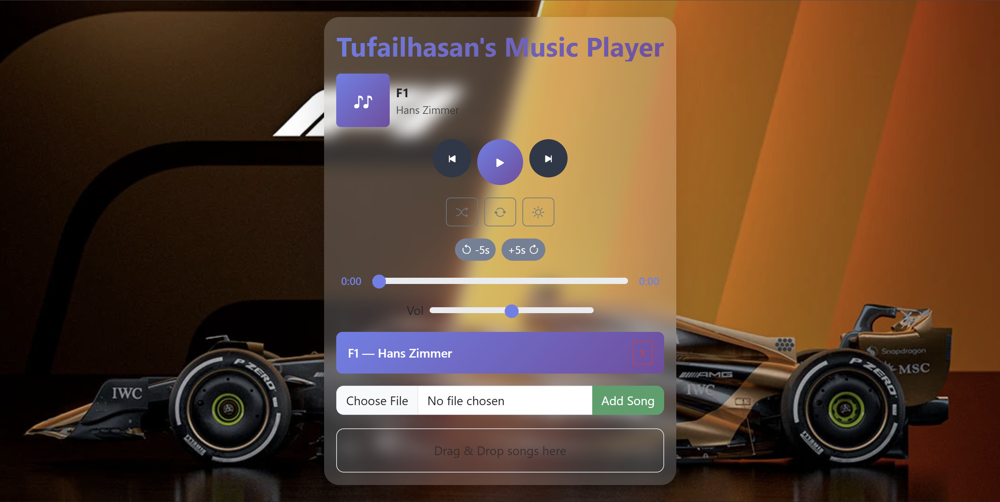

# 🎵 Music Player

> A sleek, modern, **responsive music player** built with HTML, CSS & JavaScript. Play local audio files, manage playlists, and enjoy a fully interactive experience—right in your browser!  

  

---

## 🚀 Features

### 🎶 Playback
- Play / Pause, Next, Previous  
- Rewind 5s / Forward 5s  
- Shuffle & Repeat  
- Keyboard shortcuts: Space ⏯, Arrow keys ⬆️⬇️⬅️➡️  

### 📂 Playlist & Library
- Upload songs or **drag & drop** files  
- Auto-read metadata (Title, Artist, Album Art)  
- Remove songs easily  
- Persistent playlist saved in browser (`localStorage`)  

### 🎛️ Volume & Progress
- Adjustable volume slider  
- Seek via progress bar  
- Shows **current time & duration**  

### 🌗 Theme & Design
- Light / Dark mode toggle  
- Frosted-glass, gradient UI  
- Responsive for **desktop, tablet & mobile**  

---

## 🛠️ Technologies Used
- HTML5
- CSS3 + **Bootstrap 5**
- JavaScript
- Bootstrap Icons

---

## 📝 How to Use
1. Open `index.html` in your browser.
2. Play the **default song** or add your own via **file upload / drag & drop**.
3. Use the playback controls, shuffle/repeat, and keyboard shortcuts.
4. Toggle **dark/light theme** for a personalized look.

---

## 📧 Contact
For any queries: [tufaildafedar0@gmail.com](mailto:tufaildafedar0@gmail.com)
